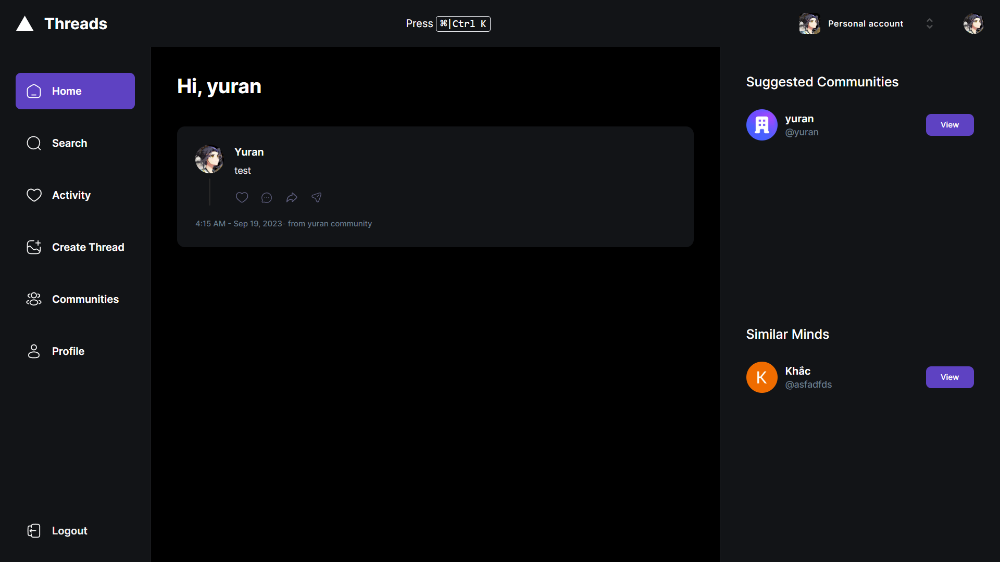
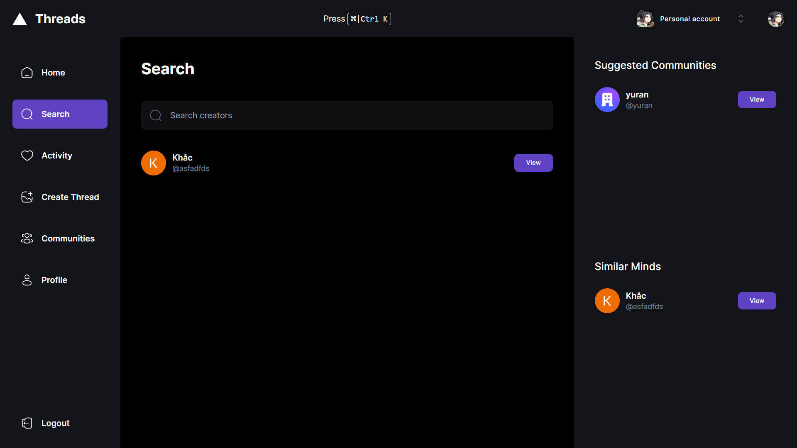
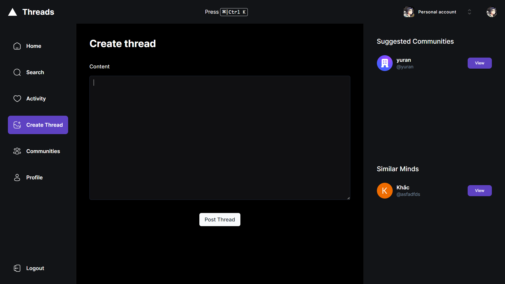
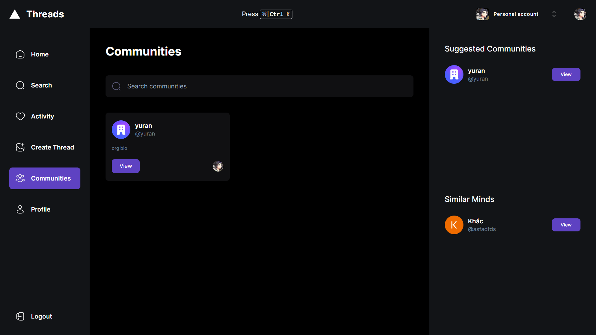
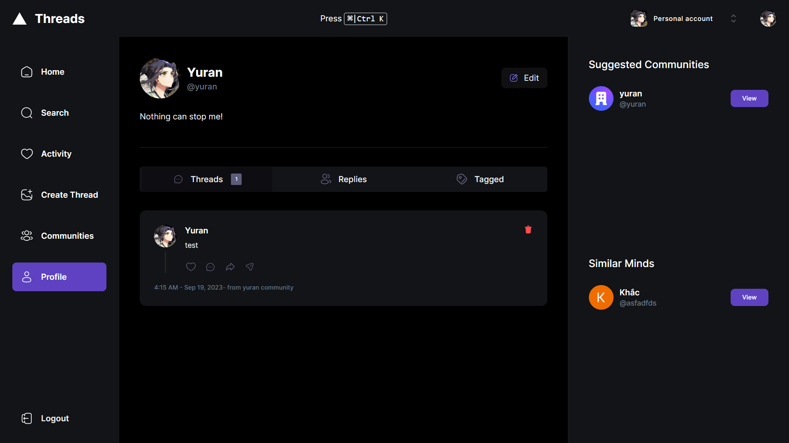
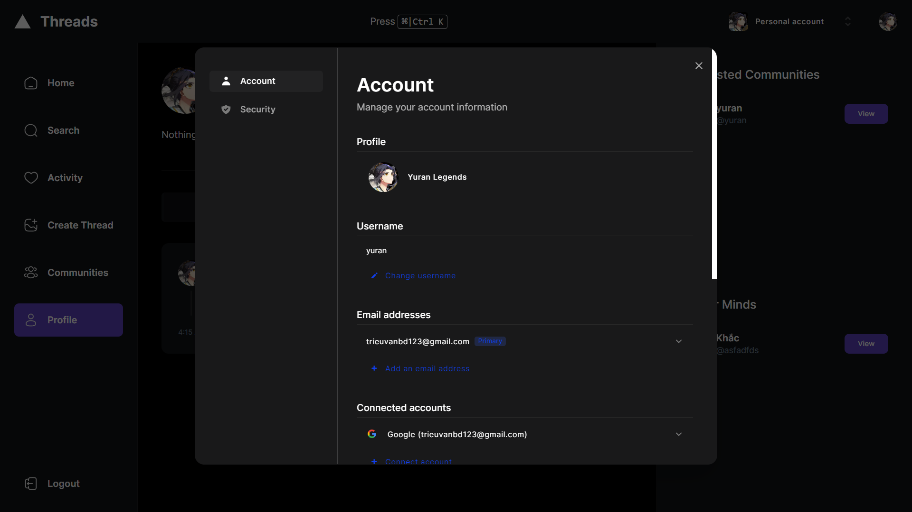

<h1 align="center">ythreads</h1>
<p align="center" style="font-size:16px"><strong>An clone version of <a href="https://www.threads.net/?hl=vi" target="_blank">Threads</a>.</strong></p>
<p align="center">  
  
</p>

<p align="center">
  
  
  
  
  
</p>

<div align="center"><a href="https://ythreads.vercel.app/" target="_blank">Live Demo</a></div>

## Features

- Create threads, thread comments
- Profile and Organization settings
- Authenticate with Google, Github, and Username

## Tech Stack


- Other libs:
  - SwiperJS (v10)
  - lucide-react (icons library)
  - ...

## Screenshots

<div style="display:flex;gap:12px;justify-content:center">
    
    
</div>
<div style="display:flex;gap:12px;justify-content:center">
    
    
</div>
<div style="display:flex;gap:12px;justify-content:center">
    
    
</div>

## Quick Start

Follow these steps to set up the project locally on your machine.

**Prerequisites**

Make sure you have the following installed or downloaded on your machine:

- [Git](https://git-scm.com/)
- [Node.js](https://nodejs.org/en)

**Cloning the Repository**

```bash
git clone https://github.com/yuran1811/ythreads.git
cd ythreads
```

**Installation**

Install the project dependencies:

```bash
npm install
```

or

```bash
yarn
```

**Running the Project**

```bash
npm run dev
```

or

```bash
yarn dev
```

Open [http://localhost:3000](http://localhost:3000) in your browser to view the project.

## References

- Read the [installation](./md/next-gen-md.md)
- More about the project can be found [here](./md/)

- [Todos](./md/todo.md)
